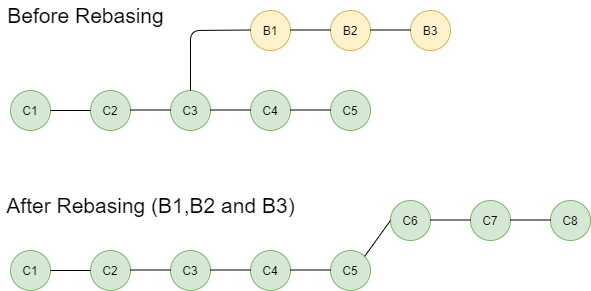

# What is HEAD in Git?

HEAD is a reference to the most recent commit in the current branch. 

When you create a new commit, Git automatically updates HEAD to point to the new commit. You can use the `git log --oneline` command to view the commit history of the current branch, and the commit at the top of the list is the one that HEAD is currently pointing to.

So, when we are talking about resetting to HEAD, it means resetting the current branch to the most recent commit. Apart from the HEAD, you can also reset to other commits with the `git reset --hard <commit-hash>` command.